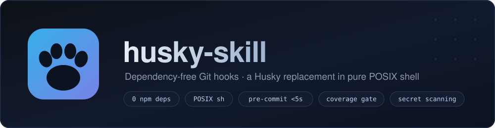
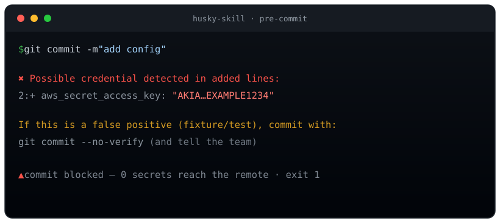

<div align="center">



<p>
  <a href="README.md">English</a> · <strong>Español</strong>
</p>

<p>
  <a href="LICENSE"></a>
  
  
  
  
</p>

</div>

Git hooks de nivel enterprise — **pre-commit, commit-msg y pre-push** — con
**cero dependencias npm**. Atrapá credenciales filtradas, problemas de formato,
errores de tipos y builds rotos *antes* de que lleguen a GitHub.

Pensado para entornos donde el árbol de dependencias es política — **fintech,
salud, gobierno** — donde no podés agregar [Husky](https://typicode.github.io/husky/)
pero necesitás todo lo que Husky hace.

> [!NOTE]
> **Instalá en una línea** — después pedile a tu agente *"instalá los git hooks en este repo"*:
> ```sh
> npx skills add KloutDevs/husky-skill
> ```

---

## Contenido

- [Por qué husky-skill](#por-qué-husky-skill)
- [Miralo funcionar](#miralo-funcionar)
- [Instalación](#instalación)
- [Qué atrapa cada hook](#qué-atrapa-cada-hook)
- [Principios de diseño](#principios-de-diseño)
- [Escape hatches](#escape-hatches)
- [Personalizar por proyecto](#personalizar-por-proyecto)
- [Requisitos](#requisitos)
- [Contribuir y Seguridad](#contribuir-y-seguridad)

---

## Por qué husky-skill

|                                    | **husky-skill**             | Husky                          |
| ---------------------------------- | --------------------------- | ------------------------------ |
| Dependencias npm                   | **0**                       | 1 + peers (lint-staged, …)     |
| Egress de red al correr el hook    | **ninguno**                 | posible (`npx` puede descargar) |
| Implementado en                    | **POSIX `sh`**              | Node + shell                   |
| Validación de mensaje de commit    | **incluida**                | necesita `commitlint`          |
| Escaneo de secretos                | **incluido, sin skip**      | no incluido                    |
| Funciona en repos con deps bloqueadas | **sí**                   | no                             |
| Huella de instalación              | **3 archivos + `git config`** | `npm install husky`          |

**El pitch:** tenés la ergonomía de Husky sin su cadena de suministro. Todo es
shell plano que podés leer, auditar y versionar en tu repo.

## Miralo funcionar

El escaneo de secretos corre sobre **líneas agregadas solamente** y **no tiene
flag de skip** — una credencial filtrada es un incidente, no una preferencia de
estilo:

<div align="center">
  
</div>

## Instalación

### Como agent skill ([skills.sh](https://skills.sh))

```sh
npx skills add KloutDevs/husky-skill
```

Después pedile a tu agente: *"instalá los git hooks en este repo"*.

### Manual (cualquier repo, sin agentes)

```sh
git clone https://github.com/KloutDevs/husky-skill
cd tu-proyecto
sh ../husky-skill/scripts/install.sh
```

Eso copia los hooks a `.githooks/`, configura `core.hooksPath` y agrega un
script `prepare` a tu `package.json` para que todo el equipo herede los hooks
con `npm install`.

> [!IMPORTANT]
> Los hooks son un **filtro, no una seguridad**. `--no-verify` existe. CI es el
> gate obligatorio — corré siempre los mismos checks ahí. Esto es feedback
> temprano, no seguridad.

## Qué atrapa cada hook

| Hook          | Checks                                                                                          | Presupuesto |
| ------------- | ----------------------------------------------------------------------------------------------- | ----------- |
| `pre-commit`  | Escaneo de secretos · `.env`/llaves bloqueadas · archivos >5MB · marcadores de conflicto · Prettier · ESLint | **<5s** |
| `commit-msg`  | Conventional Commits (`feat(scope): …`), ≤72 chars — sin `commitlint`                            | instantáneo |
| `pre-push`    | `tsc --noEmit` completo · `npm run build` · `npm test`                                           | 30s–2min    |

**pre-commit** (solo archivos staged): escanea líneas agregadas buscando llaves
de AWS, bloques de private-key, tokens de Slack/OpenAI/GitHub/GitLab/Google, JWTs
y asignaciones `password = "…"`; bloquea `.env*` (excepto `.env.example`),
`.pem`, `.key`, keystores; rechaza archivos >5MB y marcadores de conflicto sin
resolver; corre Prettier `--check` y ESLint `--max-warnings=0`.

**pre-push** (la puerta pesada): `tsc --noEmit` del proyecto completo atrapa
errores de tipos cross-file que los checks staged-only no ven, después
`npm run build` y `npm test` si esos scripts existen.

## Principios de diseño

- **Un hook lento es un hook bypasseado.** Lo rápido va en pre-commit, lo pesado
  en pre-push. Si `git commit` tardara 30s, en dos semanas todo el equipo
  commitea con `--no-verify` por reflejo y tu protección cae a cero.
- **El hook nunca modifica tus archivos.** Sin `--fix` automático: en un archivo
  con cambios staged y no-staged mezclados, un auto-fix commitearía código que
  no revisaste.
- **Cero egress.** Usa `node_modules/.bin/`, nunca `npx` (que puede descargar de
  la red). Un hook corre solo lo ya instalado y auditado.
- **Las herramientas son opcionales.** Sin ESLint instalado → ese check se salta
  en silencio. Los checks de seguridad solo necesitan `git` + `sh`.

## Escape hatches

```sh
SKIP_ESLINT=1 / SKIP_PRETTIER=1                 # en commit
SKIP_TYPESCRIPT=1 / SKIP_BUILD=1 / SKIP_TESTS=1 # en push
HUSKY=0 git commit                              # apagar todo (CI/emergencias)
git commit --no-verify                          # bypass nativo de git
```

> [!WARNING]
> El **escaneo de secretos no tiene variable de skip**. Si es un falso positivo
> genuino (un fixture o test), usá `git commit --no-verify` y avisá al equipo.

## Personalizar por proyecto

Los hooks instalados viven en el `.githooks/` de **tu** repo — shell plano,
versionado, revisable en PR. Editalos ahí. Ejemplo: si tu equipo solo aprueba
ESLint + Prettier, borrá las secciones de build/tests de `.githooks/pre-push` y
listo.

Para **desinstalar**: `git config --unset core.hooksPath` (los archivos quedan
en `.githooks/` pero dejan de correr).

## Requisitos

Git ≥2.9 y POSIX `sh`. Nada más. Node/ESLint/Prettier/TypeScript se detectan y
se usan solo si están presentes.

## Contribuir y Seguridad

- Contribuciones bienvenidas — mirá [CONTRIBUTING.md](CONTRIBUTING.md).
- ¿Encontraste una vulnerabilidad? Mirá [SECURITY.md](SECURITY.md).

## Licencia

[MIT](LICENSE) © KloutDevs
