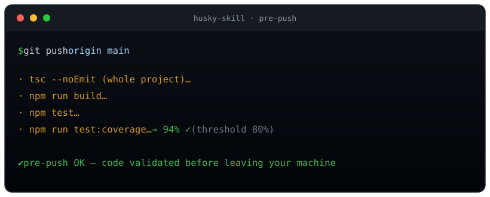

<div align="center">


<p>
  <strong>English</strong> · <a href="README.es.md">Español</a>
</p>

<p>
  <a href="CHANGELOG.md"></a>
  <a href="LICENSE"></a>
  
  
  
  
</p>

</div>

Enterprise-grade Git hooks — **pre-commit, commit-msg and pre-push** — with **zero npm dependencies**. Catch leaked secrets, formatting issues, broken types and failing builds *before* they reach GitHub.

Built for environments where the dependency tree is policy — **fintech, healthcare, government** — where you can't add [Husky](https://typicode.github.io/husky/) but you still need everything Husky does.

> [!NOTE]
> **Install in one line** — then ask your agent *"set up the git hooks in this repo"*:
> ```sh
> npx skills add KloutDevs/husky-skill
> ```

---

## Table of contents

- [Why husky-skill](#why-husky-skill)
- [See it work](#see-it-work)
- [Install](#install)
- [What each hook catches](#what-each-hook-catches)
- [Design principles](#design-principles)
- [Escape hatches](#escape-hatches)
- [Customize per project](#customize-per-project)
- [Requirements](#requirements)
- [Contributing & Security](#contributing--security)

---

## Why husky-skill

|                                   | **husky-skill**             | Husky                        |
| --------------------------------- | --------------------------- | ---------------------------- |
| npm dependencies                  | **0**                       | 1 + peers (lint-staged, …)   |
| Network egress at hook runtime    | **none** (audit is opt-in)  | possible (`npx` may fetch)   |
| Implemented in                    | **POSIX `sh`**              | Node + shell                 |
| Commit-message validation         | **built-in**                | needs `commitlint`           |
| Secret scanning                   | **built-in, not skippable** | not included                 |
| Test-coverage gate                | **built-in** (pre-push)     | needs custom config          |
| Dependency audit                  | **built-in** (opt-in)       | not included                 |
| Works in dependency-locked repos  | **yes**                     | no                           |
| Install footprint                 | **4 hook files + `git config`** | `npm install husky`      |

**The pitch:** you get Husky's ergonomics with none of its supply chain. Everything is plain shell you can read, audit and version in your repo.

## See it work

The secret scan runs on **added lines only** and has **no skip flag** — a leaked credential is an incident, not a style choice:

<div align="center">
  
</div>

And before anything leaves your machine, `pre-push` runs the heavy gate — types, build, tests and your coverage threshold:

<div align="center">
  
</div>

## Install

### As an agent skill ([skills.sh](https://skills.sh))

```sh
npx skills add KloutDevs/husky-skill
```

Then ask your agent: *"install the git hooks in this repo"*.

### Manual (any repo, no agents)

```sh
git clone https://github.com/KloutDevs/husky-skill
cd your-project
sh ../husky-skill/scripts/install.sh
```

That copies the hooks to `.githooks/`, sets `core.hooksPath`, and adds a
`prepare` script to your `package.json` so the whole team inherits the hooks on
`npm install`. Preview first with `--dry-run` (writes nothing), or target another
repo with `--root PATH`:

```sh
sh scripts/install.sh --dry-run          # show exactly what would change
sh scripts/install.sh --root ../my-repo  # install from anywhere
```

> [!IMPORTANT]
> Hooks are a **filter, not a gate**. `--no-verify` exists. CI is the mandatory
> enforcement layer — always run the same checks there. This is early feedback,
> not security.

## What each hook catches

| Hook          | Checks                                                                                          | Budget    |
| ------------- | ----------------------------------------------------------------------------------------------- | --------- |
| `pre-commit`  | Secret scan · blocked `.env`/keys · files >5MB · conflict markers · Prettier · ESLint            | **<5s**   |
| `commit-msg`  | Conventional Commits (`feat(scope): …`), ≤72 chars — no `commitlint`                             | instant   |
| `pre-push`    | full `tsc --noEmit` · `npm run build` · `npm test` · coverage · opt-in audit / API-break         | 30s–2min  |
| `post-merge`  | warns when the lockfile changed after a pull → suggests `npm install`                            | instant   |

**pre-commit** (staged files only): scans added lines for AWS keys, private-key
blocks, Slack/OpenAI/GitHub/GitLab/Google tokens, JWTs and `password = "…"`
assignments; blocks `.env*` (except `.env.example`), `.pem`, `.key`, keystores;
rejects files >5MB and unresolved conflict markers; runs Prettier `--check` and
ESLint `--max-warnings=0`.

**pre-push** (the heavy gate): full-project `tsc --noEmit` catches cross-file
type errors that staged-only checks miss, then `npm run build`, `npm test` and
your **coverage** script if they exist. Two opt-in extras: a network
**dependency audit** (`ENABLE_AUDIT=1`) and a warn-only **API-break heuristic**
(`ENABLE_API_CHECK=1`).

> [!TIP]
> Full reference — every hook type, per-stack notes, monorepos, Husky migration,
> the optional checks and CI parity — lives in
> [`references/full-guide.md`](references/full-guide.md).

## Design principles

- **A slow hook is a bypassed hook.** Fast checks go in pre-commit, heavy ones
  in pre-push. If `git commit` took 30s, within two weeks the whole team commits
  with `--no-verify` by reflex and your protection drops to zero.
- **The hook never modifies your files.** No auto `--fix`: on a file with mixed
  staged/unstaged changes, an auto-fix would commit code you never reviewed.
- **Zero egress.** Uses `node_modules/.bin/`, never `npx` (which can download
  from the network). A hook runs only what's already installed and audited.
- **Tools are optional.** No ESLint installed → that check is skipped silently.
  The security checks need only `git` + `sh`.

## Escape hatches

```sh
SKIP_ESLINT=1 / SKIP_PRETTIER=1                             # on commit
SKIP_TYPESCRIPT=1 / SKIP_BUILD=1 / SKIP_TESTS=1 / SKIP_COVERAGE=1   # on push
ENABLE_AUDIT=1 git push          # opt-in dependency audit (the only network check)
ENABLE_API_CHECK=1 git push      # opt-in removed-export warning (never blocks)
HUSKY=0 git commit                                          # skip everything
git commit --no-verify                                      # git-native full bypass
```

> [!WARNING]
> The **secret scan has no skip variable**. If it's a genuine false positive
> (a fixture or test), use `git commit --no-verify` and tell your team.

## Customize per project

Installed hooks live in **your** repo's `.githooks/` — plain shell, versioned,
reviewable in PRs. Edit them there. Example: if your team only approves ESLint +
Prettier, delete the build/test sections of `.githooks/pre-push` and you're done.

To **uninstall**: `git config --unset core.hooksPath` (the files stay in
`.githooks/` but stop running).

## Requirements

Git ≥2.9 and POSIX `sh`. That's it. Node/ESLint/Prettier/TypeScript are
detected and used only if present.

## Contributing & Security

- Contributions welcome — see [CONTRIBUTING.md](CONTRIBUTING.md).
- Found a vulnerability? See [SECURITY.md](SECURITY.md).

## License

[MIT](LICENSE) © KloutDevs
